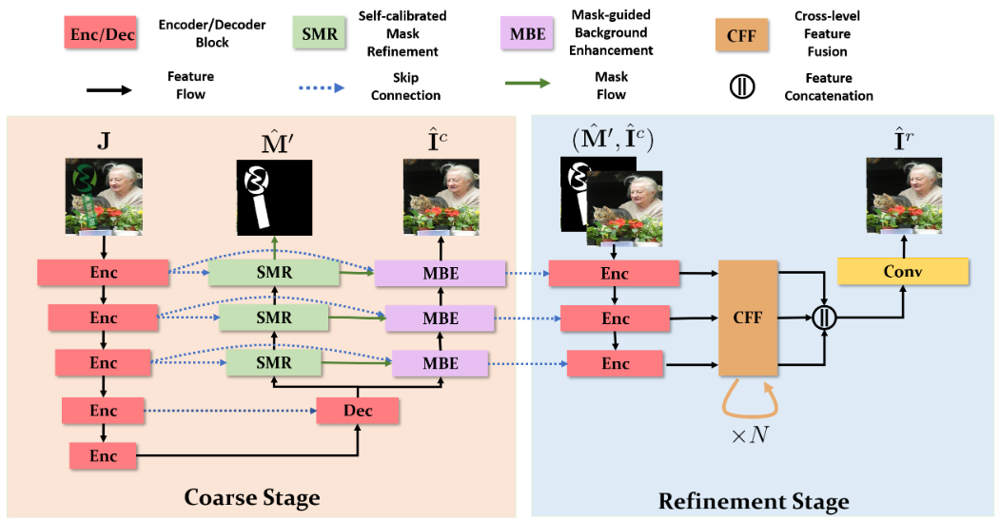

# NS-2025-01题解 —— 消影行动：去水印特工

题解作者：[HarveyMo](https://github.com/Master7Sword)

## 背景

图像去水印是计算机视觉和图像处理领域的一个子方向，这个方向并不如图像分类和图像生成那么热门，但是它涵盖了图像分割和图像恢复两个领域，可以很好地考察参赛者对于视觉问题的建模能力。同时，该领域的顶会论文数量相对稀少，对于参赛者的背景调查和信息搜集能力提出了比较大的挑战。

本赛题的数据集并非公开的去水印数据集，而是作者自行合成的数据集，无法在网上找到真实标签。原数据集共有20w+张图片，考虑到过大的规模会给参赛选手造成不必要的困扰，故从中取出了20000张作为训练集，500张作为测试集。

## 解题思路

去水印问题在早期被简单理解为image-to-image translation问题，研究人员普遍尝试采用图像恢复领域的端到端模型来去除图像的可见水印。2019年以后的研究[1,2]注意到水印区域的定位对于水印区域的恢复有非常重要的指导作用，进而开发出在恢复图像的同时预测水印区域掩码的decoder分支，比如下图所示的网络结构[3]

而我们的赛题正好提供了可利用的水印掩码ground truth（alpha文件夹）。如果要获得比较高的分数，就需要采用可以利用这些水印掩码的模型，比如SLBR[3]。这篇文章恰好就是当前在各个数据集上效果最好的开源方法，项目见[Github链接](https://github.com/bcmi/SLBR-Visible-Watermark-Removal)。如果参赛选手有幸搜索到了这篇文章的代码，还需要自己动手修改其数据集接口，并在我们提供的数据集上进行训练。按照代码中的默认配置完成训练后，预期可以稳定获得90%的分数。

如果还期望进一步卷分数，可以从数据集下手。Andrew Ng曾提出著名的二八定律：80%的数据+20%的模型=更好的AI。相比于简单地卷模型，数据质量往往起到更加决定性的作用。在图像恢复领域，两万张图片的训练集其实是一个比较小的规模，为了进一步提升模型的性能，可以自行搜索其他开源的水印数据集（如CLWD, LOGO-30K等），并与我们提供的训练集合并后进行训练。

## Reference

1. AmirHertz,SharonFogel,RanaHanocka,RajaGiryes,andDanielCohen-Or. 2019. Blind Visual Motif Removal from a Single Image. In Proceedings of the IEEE/CVF Conference on Computer Vision and Pattern Recognition(CVPR).
2. Xiaodong Cun and Chi-Man Pun.2021. Split Then Refine:Stacked Attention Guided ResUNets for Blind Single Image Visible Watermark Removal. In Proceedings of the AAAI Conference on Artificial Intelligence(AAAI).
3. Jing Liang, Li Niu, Fengjun Guo, Teng Long, and Liqing Zhang. Visible watermark removal via self-calibrated localization and background refinement. In ACMMM, 2021