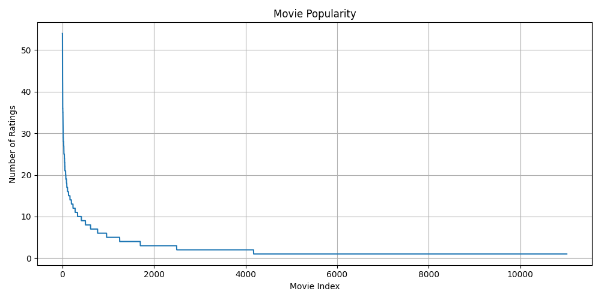
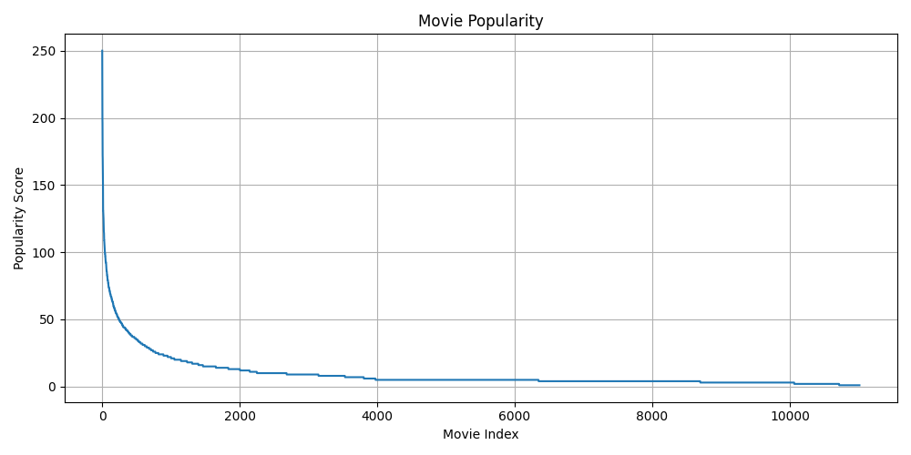

# NS-2025-04 题解 —— 冷启动之劫如何破？

## 1 赛题背景

在推荐算法中，**冷启动**问题指的是新用户或新物品因缺乏历史交互数据而导致推荐效果不佳的挑战。

本题给出了用户间的关系，且测试集包含的用户从未在训练集中出现过，有队伍在 WP 里反馈自己的模型在训练集上表现很好，但是评分时得分不高，这种情况正好体现了冷启动问题。

推荐系统中存在明显的**马太效应**：数据分布是不均衡的，受欢迎的物品获得更多曝光与交互，导致冷门物品进一步被忽视，马太效应在本题的数据集中也有所体现。

除了马太效应，推荐系统的数据集通常是十分**稀疏**的，如何应对数据集自带的稀疏性会是采用**图神经网络**来解题的队伍需要考虑的问题。

## 2 题解

### 2.1 数据预处理

本题提供的数据集，对电影的评分有 (1~5) 共五个评级，有的队伍选择按照题目意思，把评分大于等于 4 的数据映射为正标签，反之为负标签，按二分类的训练流程去做。

但更简单且有效的办法是直接将评分归一化至 (0~1.0)，让模型直接学习电影对应的评分，推荐时评分大的电影优先就行了。除非使用涉及了对比学习的方法，否则题目中给出的喜欢/不喜欢信息在后续的训练都是**干扰信息**。

### 2.2 基于数理统计

本题数据集具有非常明显的**马太效应**，受欢迎的物品会获得更多曝光与交互。一般科研领域里的研究都是想降低马太效应，但是本题只是要求选手给出测试集选手的喜好，所以在这里我们可以利用马太效应。



上图给出了各电影被评分次数的可视化。



上图给出了各电影综合热度(次数 x 平均分)的可视化。

其中综合热度前 10 的电影为：

`[22243, 14549, 10581, 10873, 18465, 21490, 21547, 14629, 25943, 22476]`

在不考虑社交关系的情况下，直接提交这 10 个电影，可以得到近 300 分。

考虑社交关系，针对各个用户的关注列表进行额外加分，最后得到各电影的综合热度，也可以获得不错的分数。

有队伍通过数理统计，不断提交同一电影，根据评测日志记录下各个热门电影在测试集的 Recall@1 值，进而直接人工组合得到满分提交，是一种非常巧妙的解法。

### 2.3 基于 SVD

SVD（奇异值分解）是一种矩阵分解技术，广泛应用于推荐系统中。它通过将用户-物品评分矩阵分解成三个矩阵的乘积，提取潜在的特征模式，从而进行个性化推荐。

给定一个用户-物品评分矩阵 \( R \)，SVD 将其分解为：

\[
R \approx U \Sigma V^T
\]

- \( U \)：用户特征矩阵，大小为 \( m \times k \)，其中 \( m \) 为用户数量，\( k \) 为潜在特征维度。
- \( \Sigma \)：奇异值矩阵，大小为 \( k \times k \)，其中对角线元素表示潜在特征的权重。
- \( V^T \)：物品特征矩阵，大小为 \( k \times n \)，其中 \( n \) 为物品数量。

通过这种降维，SVD 能够捕捉到评分矩阵中潜在的用户和物品之间的关系。

对于未评分的物品，SVD 使用已分解的矩阵来预测评分：

\[
\hat{R}_{ij} = U_i \cdot \Sigma \cdot V_j^T
\]

其中，\( \hat{R}_{ij} \) 是用户 \( i \) 对物品 \( j \) 的预测评分。

我们可以使用 **surprise** 库来简化我们的 SVD 流程。

```python
import os
import pandas as pd
import numpy as np
from surprise import SVD, Dataset, Reader
from collections import defaultdict

ratings_dict = pd.read_csv(os.path.join("data/input_data", "train_label.csv"))
df = pd.DataFrame(ratings_dict)
reader = Reader(rating_scale=(1, 5))
data = Dataset.load_from_df(df[["userID", "movieID", "movieRating"]], reader)

trainset = data.build_full_trainset()
model = SVD(random_state=42)
model.fit(trainset)
```

然后根据用户间的关系，加权关注用户的喜好得到测试集用户的喜好电影。

```python
def get_top_k_recommendations(user_id, k=10):
    predictions = []
    for item_id in item_id_map.keys():
        pred = algo.predict(str(user_id), item_id)
        predictions.append((item_id, pred.est))
    predictions.sort(key=lambda x: x[1], reverse=True)
    return [item_id for item_id, _ in predictions[:k]]

results = []
for test_user in test_users['userID']:
    trustees = trust_df[trust_df['trustorID'] == test_user]['trusteeID'].tolist()
    
    movie_scores = defaultdict(float)
    for trustee in trustees:
        top_movies = get_top_k_recommendations(trustee, k=10)
        weight = trustee_rating_counts.get(trustee, 1) / max(trustee_rating_counts.values())
        for movie_id in top_movies:
            pred_score = algo.predict(str(test_user), str(movie_id)).est
            movie_scores[movie_id] += pred_score * weight
    
    recommended_movies = [(movie_id, score) for movie_id, score in movie_scores.items()]
    recommended_movies.sort(key=lambda x: x[1], reverse=True)
    top_10_movies = [movie_id for movie_id, _ in recommended_movies[:10]]】
```

SVD 分解是推荐算法领域里常用的机器学习算法，类似的机器学习算法还有 FM。

### 2.4 引入可训练参数

TrustSVD 是一种解决协同过滤中数据稀疏和冷启动问题的矩阵分解技术，是 SVD 算法在深度学习领域的再应用。

论文地址：https://aaai.org/ocs/index.php/AAAI/AAAI15/paper/view/9313

此算法实际上就是引入了可训练参数的 SVD 算法，相关代码实现可以参考：https://github.com/gtshs2/TrustSVD/tree/master

下放给出 Pytorch 的模型参考代码：

```python
import torch
import torch.nn as nn
import torch.optim as optim
import torch.nn.functional as F

class TrustSVD(nn.Module):
    def __init__(self, num_users, num_items, hidden_neuron, R, mask_R, C, train_R, train_mask_R, test_R, test_mask_R,
                 num_train_ratings, num_test_ratings, trust_matrix, lambda_list, train_ratio, lr, optimizer_method,
                 display_step, random_seed, decay_epoch_step, lambda_value, model_name):
        super(TrustSVD, self).__init__()

        self.num_users = num_users
        self.num_items = num_items
        self.hidden_neuron = hidden_neuron

        # Placeholders for the data
        self.R = R
        self.mask_R = mask_R
        self.C = C
        self.train_R = train_R
        self.train_mask_R = train_mask_R
        self.test_R = test_R
        self.test_mask_R = test_mask_R
        self.num_train_ratings = num_train_ratings
        self.num_test_ratings = num_test_ratings
        self.trust_matrix = torch.tensor(trust_matrix, dtype=torch.float32)

        # Hyperparameters
        self.lambda_value = lambda_list[0]
        self.lambda_t_value = lambda_list[1]
        self.lr = lr
        self.optimizer_method = optimizer_method
        self.display_step = display_step

        # Variables for biases and latent vectors
        self.b_u = nn.Parameter(torch.zeros(num_users, 1))  # User bias
        self.b_j = nn.Parameter(torch.zeros(num_items, 1))  # Item bias
        self.p_u = nn.Parameter(torch.randn(num_users, hidden_neuron) * 0.03)  # User latent vectors
        self.q_j = nn.Parameter(torch.randn(num_items, hidden_neuron) * 0.03)  # Item latent vectors
        self.y_i = nn.Parameter(torch.randn(num_items, hidden_neuron) * 0.03)  # Item latent vectors for rating prediction
        self.w_v = nn.Parameter(torch.randn(num_users, hidden_neuron) * 0.03)  # User latent vectors for trust prediction

        # Constant for mean of ratings
        self.mu = torch.sum(self.train_R) / float(self.num_train_ratings)

        # Trust matrix, user/item mask, etc.
        self.I_u = torch.sum(self.mask_R, dim=1)
        self.U_j = torch.sum(self.mask_R, dim=0)
        self.T_u = torch.sum(self.trust_matrix, dim=1)
        self.T_v = torch.sum(self.trust_matrix, dim=0)

        self.inverse_I_u = 1. / self.I_u
        self.inverse_U_j = 1. / self.U_j
        self.inverse_T_u = 1. / self.T_u
        self.inverse_T_v = 1. / self.T_v

        self.sqrt_inverse_I_u = torch.sqrt(self.inverse_I_u.view(-1, 1))
        self.sqrt_inverse_U_j = torch.sqrt(self.inverse_U_j.view(-1, 1))
        self.sqrt_inverse_T_u = torch.sqrt(self.inverse_T_u.view(-1, 1))
        self.sqrt_inverse_T_v = torch.sqrt(self.inverse_T_v.view(-1, 1))

    def forward(self, input_R, input_mask_R):
        # Precomputed terms
        pre_r_hat1 = self.b_u @ torch.ones(1, self.num_items) + torch.ones(self.num_users, 1) @ self.b_j.T \
                     + self.mu * torch.ones(self.num_users, self.num_items)

        pre_r_hat2 = self.p_u @ self.q_j.T

        temp_r_hat3_1 = []
        temp_r_hat3_2 = []
        for user in range(self.num_users):
            user_specific_mask_r = input_mask_R[user, :]
            user_specific_trust_matrix = self.trust_matrix[user, :]
            zero = torch.tensor(0.0)

            if self.I_u[user] == 0:
                temp_r_hat3_1.append(torch.zeros(self.hidden_neuron))
            else:
                where = torch.ne(user_specific_mask_r, zero)
                indices = torch.nonzero(where).squeeze()
                indexed_y_i = self.y_i[indices]
                sum_y_i = torch.sum(indexed_y_i, dim=0) * self.sqrt_inverse_I_u[user]
                temp_r_hat3_1.append(sum_y_i)

            if self.T_u[user] == 0:
                temp_r_hat3_2.append(torch.zeros(self.hidden_neuron))
            else:
                where = torch.ne(user_specific_trust_matrix, zero)
                indices = torch.nonzero(where).squeeze()
                indexed_w_v = self.w_v[indices]
                sum_w_v = torch.sum(indexed_w_v, dim=0) * self.sqrt_inverse_T_u[user]
                temp_r_hat3_2.append(sum_w_v)

        temp_r_hat3_1 = torch.stack(temp_r_hat3_1)
        temp_r_hat3_2 = torch.stack(temp_r_hat3_2)
        pre_r_hat3 = temp_r_hat3_1 @ self.q_j.T + temp_r_hat3_2 @ self.q_j.T

        r_hat = pre_r_hat1 + pre_r_hat2 + pre_r_hat3

        # Make t_hat (Trust prediction)
        t_hat = self.p_u @ self.w_v.T

        # Compute the cost
        cost1 = 0.5 * torch.sum((r_hat - input_R) ** 2 * input_mask_R) \
                + 0.5 * self.lambda_t_value * torch.sum((t_hat - self.trust_matrix) ** 2 * self.trust_matrix)

        cost2 = 0.5 * self.lambda_value * torch.sum(self.sqrt_inverse_I_u.T * self.b_u ** 2) \
                + 0.5 * self.lambda_value * torch.sum(self.sqrt_inverse_U_j.T * self.b_j ** 2)

        pre_cost3 = 0.5 * self.lambda_value * self.sqrt_inverse_I_u.T
        frob_p_u = torch.sum(self.p_u ** 2, dim=1).view(self.num_users, 1)
        cost3 = torch.sum(pre_cost3 * frob_p_u)

        frob_q_j = torch.sum(self.q_j ** 2, dim=1).view(self.num_items, 1)
        frob_y_i = torch.sum(self.y_i ** 2, dim=1).view(self.num_items, 1)
        cost4 = 0.5 * self.lambda_value * torch.sum(self.sqrt_inverse_U_j.T * frob_q_j) \
                + 0.5 * self.lambda_value * torch.sum(self.sqrt_inverse_U_j.T * frob_y_i)

        frob_w_v = torch.sum(self.w_v ** 2, dim=1).view(self.num_users, 1)
        cost5 = 0.5 * self.lambda_value * torch.sum(self.sqrt_inverse_T_v.T * frob_w_v)

        total_cost = cost1 + cost2 + cost3 + cost4 + cost5
        return total_cost, r_hat
```

### 2.5 图嵌入

此题还可以使用图嵌入来解，类似的还可以使用图神经网络。

图嵌入方法通过将图结构数据（如用户-物品关系图）廘入到低维空间，捕捉节点间的潜在关系，从而进行推荐。

将用户和物品视为图中的节点，用户和物品之间的评分或互动构成图中的边。

常见的图嵌入算法有 **DeepWalk**、**Node2Vec** 或图神经网络（**GNN**）来学习每个节点的高维表示。

**此方法的最终目的是得到用户与物品的高维表示，然后通过距离（比如欧几里得距离）计算给出各用户的喜好物品。**

以下是 Node2Vec 方法的简单举例.

Node2Vec 是基于随机游走的一种图嵌入算法，它通过定义邻域采样策略（深度优先、广度优先）来优化图嵌入，使得学习到的节点嵌入能够保留更多的图结构信息。

可参考的伪代码如下：

```python
import networkx as nx
from node2vec import Node2Vec

G = nx.Graph()
G.add_edges_from(df[['userID', 'movieID']].values)

node2vec = Node2Vec(G, dimensions=64, walk_length=30, num_walks=200, workers=4)

model = node2vec.fit()

user_embeddings = model.wv['userID']
movie_embeddings = model.wv['movieID']
```

同时对于图神经网络，推荐场景的数据集可是具有出了名的稀疏，所以一般的 GCN 并不能取得很好的效果。

此时可以考虑多特征地引入**超图神经网络**，会取得不错的效果，