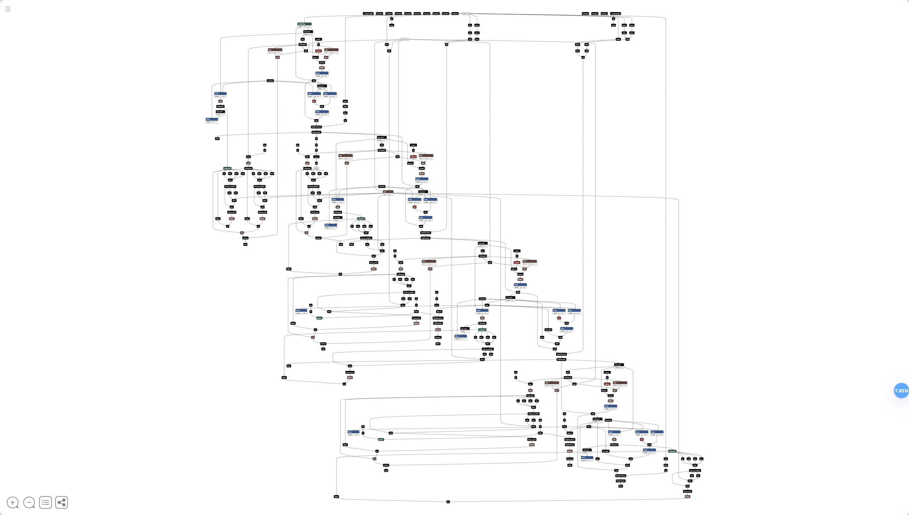
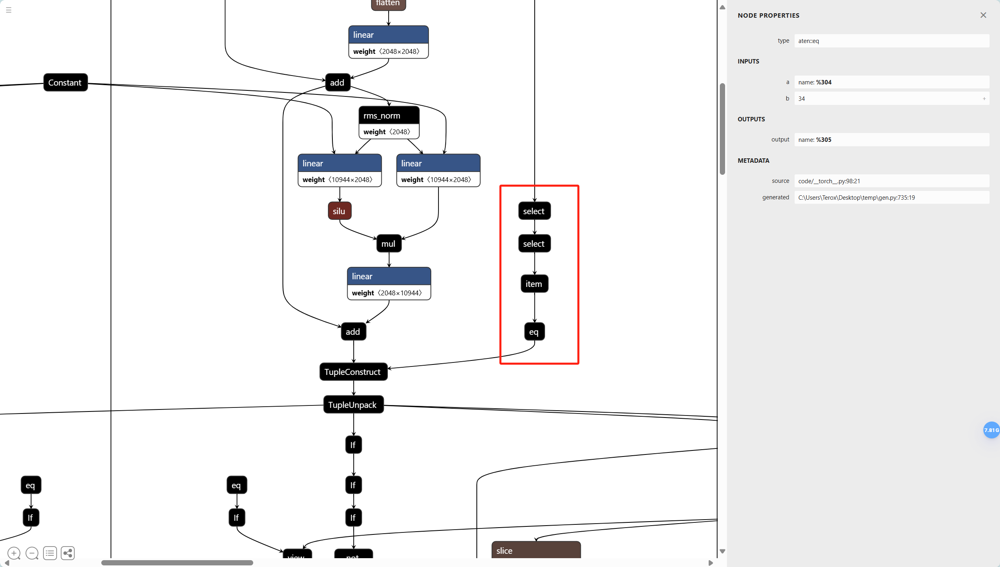
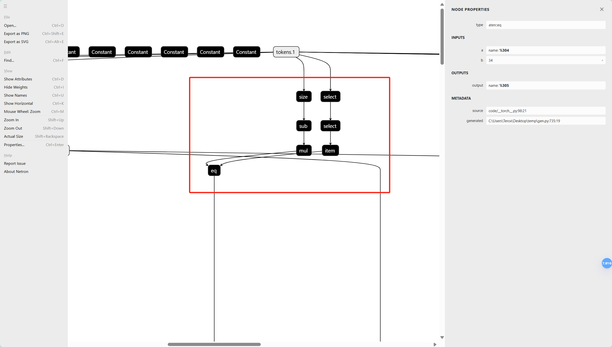
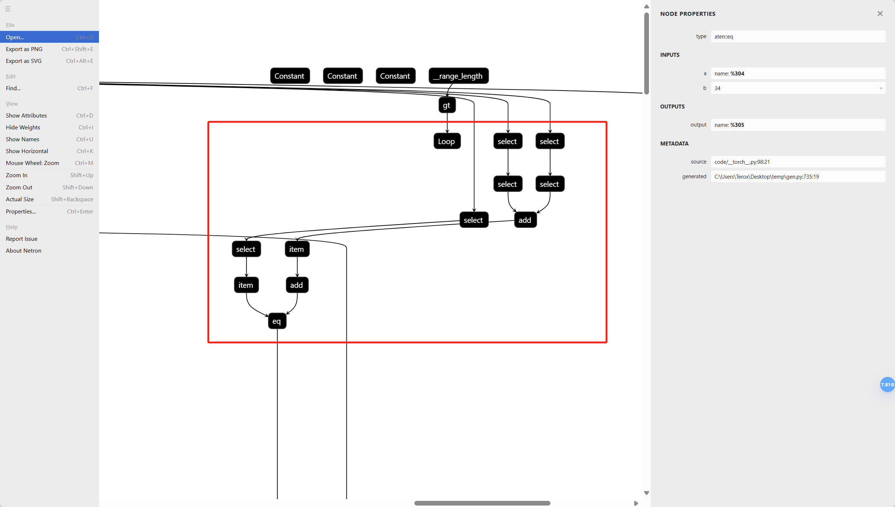
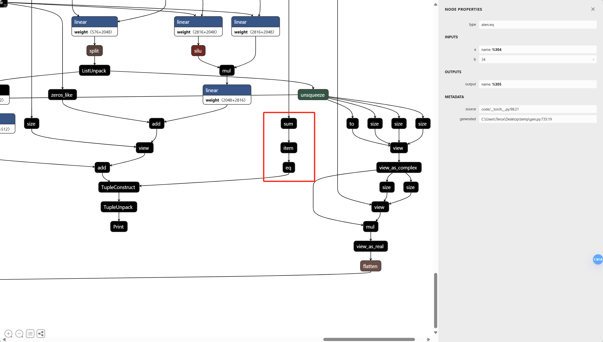

# NS-2025-06 题解 —— Key-DeepSeek-v3

## 1 赛题背景

计算图（Computation Graph）在深度学习中扮演着至关重要的角色，它通过将复杂的计算过程结构化，便于高效地进行模型训练与推理。

计算图的节点代表操作（如加法、乘法、激活函数等），边表示数据流或操作的依赖关系。

在多卡训练中，深度学习框架会依据计算图来实现多卡间数据的流动控制以及计算负载的均衡。

在本地加速推理中，计算图作为神经网络的中间表示，能够被转化为适合硬件加速器（如GPU、TPU等）优化的执行计划，从而显著提高推理速度。

常见的计算图格式包括 TensorFlow 的 GraphDef、PyTorch 的 TorchScript 以及 ONNX 等。

## 2 题解

本题的计算图来自于 DeepSeek-v3 的官方 Pytorch 实现，但是官方的实现还参杂了很多用 Triton 写的自定义算子，所以出题人用了一上午的时间修改源码，得到了 DeepSeek-v3 的纯 Pytroch 实现，并把能直接导出计算图的代码作为附加文件发给选手。

理论上附加的 `model.py` 文件只要配置好 Torch 环境就可以运行(甚至只需要配置 CPU 版本的库)。

此题的解法非常丰富，但最终目的都是：**获取密钥的逻辑，构造密钥**

### 2.1 暴力破解

有两只队伍采用暴力破解的手段，虽然这种做法比较耗费时间，但是能拿到分的做法就是好方法。

### 2.2 TorchScript

这是大部分队伍采用的做法。

赛题数据集提供的 `.pt` 文件，实际上只有 8GB 大小，完全可以直接读取，直接查看被注入模型的 TorchScript。

```python
import torch

model = torch.jit.load("Key_DeepSeek_v3.pt")
print(model.code)
```

可以得到如下表示：

```
def forward(self,
    tokens: Tensor,
    start_pos: int=0) -> Tensor:
  seqlen = torch.size(tokens, 1)
  embed = self.embed
  h = (embed).forward(tokens, )
  freqs_cis = self.freqs_cis
  freqs_cis0 = torch.slice(freqs_cis, 0, start_pos, torch.add(start_pos, seqlen))
  layers = self.layers
  _0 = getattr(layers, "0")
  _1 = getattr(layers, "1")
  _2 = getattr(layers, "2")
  _3 = getattr(layers, "3")
  _4 = (_0).forward(h, start_pos, freqs_cis0, None, tokens, )
  h0, layer_flag, = _4
  print(layer_flag)
  _5 = (_1).forward(h0, start_pos, freqs_cis0, None, tokens, )
  h1, layer_flag0, = _5
  print(layer_flag0)
  if layer_flag:
    flag = layer_flag0
  else:
    flag = False
  _6 = (_2).forward(h1, start_pos, freqs_cis0, None, tokens, )
  h2, layer_flag1, = _6
  print(layer_flag1)
  if flag:
    flag0 = layer_flag1
  else:
    flag0 = False
  _7 = (_3).forward(h2, start_pos, freqs_cis0, None, tokens, )
  h3, layer_flag2, = _7
  print(layer_flag2)
  if flag0:
    flag1 = layer_flag2
  else:
    flag1 = False
  if torch.__not__(flag1):
    _8 = torch.zero_(tokens)
  else:
    norm = self.norm
    h4 = torch.select(torch.slice((norm).forward(h3, )), 1, -1)
    head = self.head
    _8 = (head).forward(h4, )
  return _8
```

此时我们稍加查看，就会发现里面有些控制逻辑，会根据输入的数值情况来控制模型的输出。

Pytorch 的模型在底层组织上是像树一样的，所以我们可以递归的调用 `.code()` 函数。

本题的密钥逻辑都是硬编码在模型里的，找起来非常简单，定位查找类似 `prim::If` 的代码段即可。

耐心查找或全局关键词搜索后，可以大致得知密钥逻辑如下：

```
(tokens[0][0] == 34)
(tokens[0][1] == 134 × (tokens.shape[1] - 1))
(tokens[0][2] == tokens[0][0] + tokens[0][1] + 4010)
(sum(tokens[0]) == 30315)
```

最终得到密钥 `[34, 402, 4447, 25432]`

### 2.3 计算图可视化

有两只队伍采用可视化软件来分析计算图，这也是出题人最提倡的做法。

将 `.pt` 文件上传到 https://netron.app/



放大后可以分别找到四个密钥的判别逻辑处。







