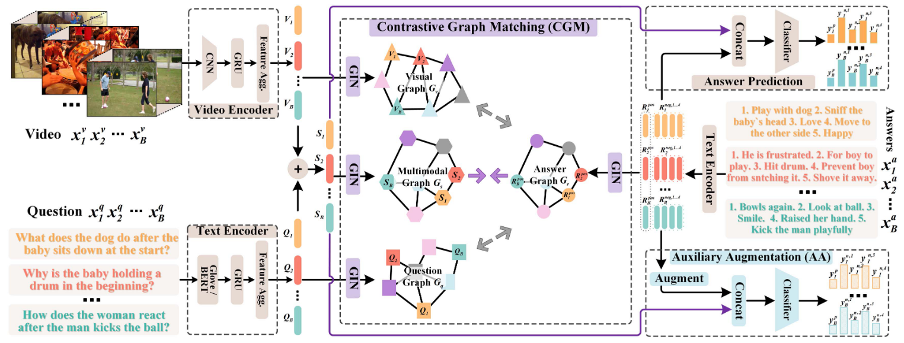

# NS-2025-10 题解 —— 帧帧皆玄机

参考项目链接：https://github.com/zhangxi1997/NExT-OOD/tree/main

## 题目背景
多项选择视频问答任务中，每条样本由一段视频、一个问题以及多个候选答案组成（包括一个正确答案和若干错误答案）。模型需要判断哪一个候选答案最符合视频和问题所表达的语义。

## 题目思路
模型的整体架构包括基础网络、对比图匹配模块和辅助增强模块。



基础网络从视频、问题和候选答案中提取多模态特征，并通过融合表示进行初步预测。为了减少对浅层关联的依赖，引入对比图匹配模块，构建基于样本相关性的图结构。通过图神经网络编码跨样本关系，设计对比损失，模型被引导聚焦于多模态语义而 VA 偏差或 QA 偏差。同时，为增强模型的鲁棒性，提出辅助增强模块，利用最相关的几个样本的答案替换目标样本的错误答案以生成增强样本。

```
vid_encoder = EncoderRNN.EncoderVidHGA(vid_dim, hidden_dim, input_dropout_p=0.3, bidirectional=False, rnn_cell='gru')

qns_encoder = EncoderRNN.EncoderQns(word_dim, hidden_dim, vocab_size, self.glove_embed, self.use_bert, n_layers=1, rnn_dropout_p=0, input_dropout_p=0.3, bidirectional=False, rnn_cell='gru')

self.model = GCS.GraphCrossSampleDebias(vid_encoder, qns_encoder, self.device, layer_num=self.gin, e=self.delta)
```

模型最终联合优化基础预测损失、对比图损失及增强样本损失，多角度约束学习过程。

```
def train(self, epoch):
    print('==>Epoch:[{}/{}][lr_rate: {}]'.format(epoch, self.epoch_num, self.optimizer.param_groups[0]['lr']))
    self.model.train()
    total_step = len(self.train_loader)
    epoch_loss = 0.0
    prediction_list = []
    answer_list = []
    for iter, inputs in enumerate(tqdm(self.train_loader)):
        videos, qas, qas_lengths, answers, _, candidate_as, a_lengths , candidate_qs, q_lengths, cate_tensor, cate_flag = inputs
        video_inputs = videos.to(self.device)
        qas_inputs = qas.to(self.device)
        ans_targets = answers.to(self.device)
        candidate_as = candidate_as.to(self.device)
        candidate_qs = candidate_qs.to(self.device)

        out, prediction, final_loss_graph, loss_graph, out_new, prediction_new, final_loss_graph_new = self.model(video_inputs, qas_inputs, qas_lengths, candidate_as, a_lengths, candidate_qs, q_lengths, ans_targets, cate_tensor, epoch, cate_flag, isTrain=True)

        self.model.zero_grad()
        loss_org = self.criterion(out, ans_targets)
        loss_cate = self.criterion(out_new, ans_targets)
        lambda_1 = self.lambda1
        lambda_2 = self.lambda2
        loss = loss_org + lambda_1*final_loss_graph + lambda_1*final_loss_graph_new + lambda_2*loss_cate

        loss.backward()
        self.optimizer.step()
        cur_time = time.strftime("%Y-%m-%d %H:%M:%S", time.localtime())
        if iter % self.vis_step == 0:
            print('\t[{}/{}]-{}  loss: {:.4f} loss_org: {:.4f} loss_cate: {:.4f} final_loss_graph: {:.4f} (qv: {:.4f} q: {:.4f} v: {:.4f}) final_loss_graph_new: {:.4f}'.format(iter, total_step, cur_time, loss.item(),loss_org.item(),loss_cate.item(), final_loss_graph, loss_graph[0].item(), loss_graph[1].item(), loss_graph[2].item(), final_loss_graph_new))

        epoch_loss += loss.item()

        prediction_list.append(prediction)
        answer_list.append(answers)

    predict_answers = torch.cat(prediction_list, dim=0).long().cpu()
    ref_answers = torch.cat(answer_list, dim=0).long()
    acc_num = torch.sum(predict_answers==ref_answers).numpy()

    return epoch_loss / total_step, acc_num*100.0 / len(ref_answers)
```

在多个视频问答数据集上，该方法显著提升了模型的准确率和鲁棒性，展现出良好的去偏效果和多模态推理能力。


